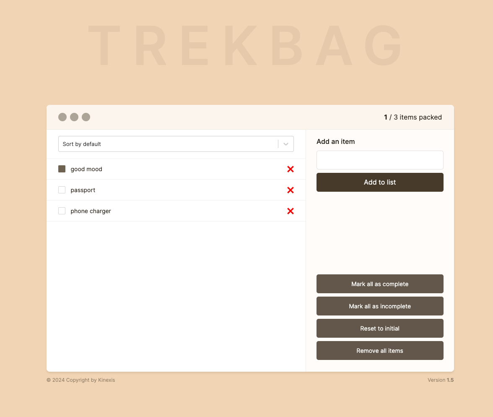

# TrekBag

TrekBag is a simple, yet powerful packing list application built with React. It allows users to add items to a list, mark them as packed or unpacked, and sort them based on their packed status. The application is designed to be intuitive and user-friendly, making packing for your next trip a breeze.



## Libraries and Techniques Used

### React

React is a JavaScript library for building user interfaces. It allows us to create reusable UI components. In this project, we use functional components and hooks extensively. For example, in `src/components/AddItemForm.jsx`, we use the `useState` and `useRef` hooks to manage the state of the form and the input field.

### Zustand

Zustand is a small, fast and scaleable bearbones state-management solution. It has a simple, but powerful API. We use Zustand in `src/stores/itemsStore.js` to manage the state of the items in the packing list. It also uses local storage to persist the data between sessions.

### React-Select

React-Select is a flexible and customizable Select Input control for React. It provides a robust solution for adding a select control to your React application. We use React-Select in `src/components/ItemList.jsx` to provide a dropdown menu for sorting the items in the list.

### ESLint

ESLint is a tool for identifying and reporting on patterns found in ECMAScript/JavaScript code. In this project, we use ESLint to enforce code quality and maintainability. The configuration for ESLint can be found in `.eslintrc.cjs`.

### Vite

Vite is a build tool that aims to provide a faster and leaner development experience for modern web projects. It provides a development server with Hot Module Replacement (HMR) and a build command for production. In this project, we use Vite to serve and build our application.

## React Techniques

### Context API

The Context API is a component structure provided by the React framework, which enables us to share specific forms of data across all levels of the application. In this project, we started using the context api, but replaced it with Zustand. The code is still available for reference inside the `contexts` folder.

### Hooks

Hooks are a new addition in React 16.8. They let you use state and other React features without writing a class. In this project, we use various hooks like `useState`, `useEffect`, `useContext`, and `useMemo` to manage state and side effects in our functional components.

## Running the Project

Before you run the project, install the dependencies:

```sh
npm run i
```

To run the project, use the following command:

```sh
npm run dev
```

To build the project for production, use the following command:

```sh
npm run build
```
